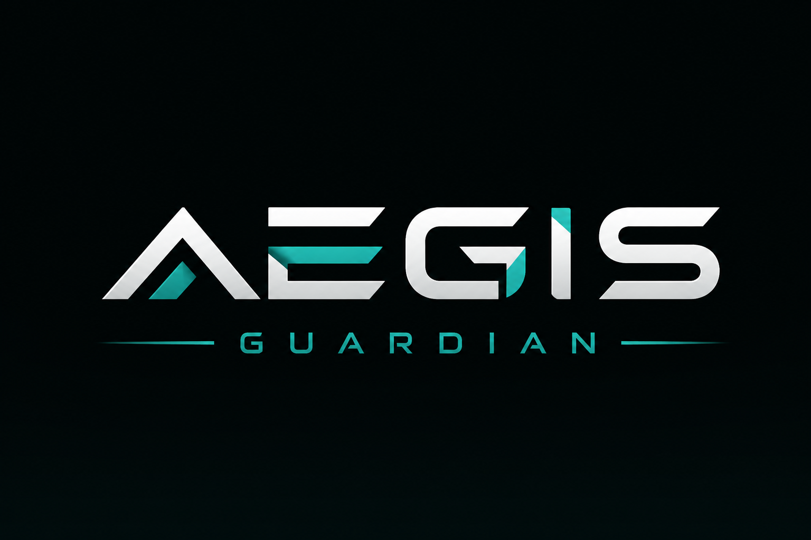
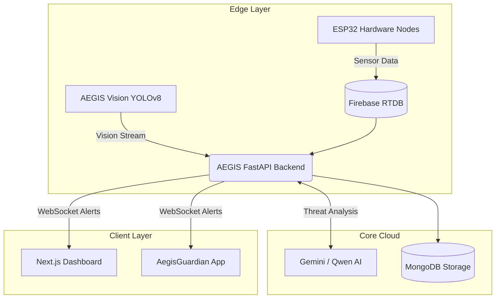

  

  # 🛡️ AEGIS Mission Control
  
  **AI-Powered Campus Emergency Incident Commander**

  

    
    
    
    
    
    
  

 

## 📖 Overview

**AEGIS Mission Control** is a comprehensive, AI-driven emergency response and campus monitoring ecosystem. It fuses real-time hardware sensor data with advanced AI reasoning (powered by Gemini & Qwen2.5) to detect, analyze, and instantly broadcast critical incidents across a campus or facility. 

When an emergency occurs, every second counts. AEGIS connects smart sensor nodes, computer vision feeds, a robust AI brain, a real-time web dashboard, and a mobile application to ensure security teams have absolute situational awareness.

> **Our Mission:** To reduce response times from minutes to seconds by utilizing AI to filter noise, detect genuine threats, and coordinate rapid response protocols.

### 🎯 What Problems Does AEGIS Solve?
Traditional security and monitoring systems often suffer from:
- **Siloed Information:** Data from fire alarms, CCTV, and motion sensors are rarely integrated.
- **High False Alarm Rates:** Non-intelligent sensors cannot distinguish between a minor anomaly and a critical threat.
- **Delayed Response:** First responders lack real-time, context-rich data about the incident before arriving on the scene.

**AEGIS** solves these by acting as a central nervous system. It ingests data from various modalities, uses AI to cross-reference and validate threats (e.g., correlating a temperature spike with visual smoke detection), and instantly pushes actionable intelligence to operators.

### ⚙️ How It Works
1. **Sensory Ingestion:** Edge hardware nodes (ESP32) gather environmental data (Temperature, Gas, Flame, Motion, Distance), while computer vision modules monitor visual feeds using YOLOv8.
2. **AI Reasoning:** The data streams are sent to the FastAPI backend where advanced AI models (Gemini/Qwen) analyze the context. The AI evaluates the severity, filters out noise, and generates a structured incident report.
3. **Instant Dissemination:** Validated threats are broadcasted via sub-second WebSockets to the Mission Control Web Dashboard (Next.js) for central command, and the AegisGuardian Mobile App (Flutter) for boots-on-the-ground responders.

### 🏢 Target Environments
- **University & College Campuses:** Ensuring student safety across large, distributed areas.
- **Industrial Facilities & Warehouses:** Monitoring hazardous conditions and enforcing safety perimeters.
- **Corporate Campuses & Smart Buildings:** Providing integrated security and emergency management.
- **Event Venues:** Real-time crowd monitoring and rapid incident response.

---

## ✨ Key Features

- 🔌 **Real-Time Sensor Fusion:** Gathers multi-modal data from custom ESP32 hardware nodes (Temperature, Gas, Flame, Motion, Distance).
- 🧠 **AI Brain (Backend):** Analyzes fused data streams in real-time. Employs Google Gemini (with fallback models) to identify threats, assess severity, and minimize false positives.
- ⚡ **Instant Alerts:** Dispatches sub-second WebSocket broadcasts directly to web and mobile clients.
- 👁️ **Computer Vision:** Integrates YOLOv8 object detection for visual threat confirmation and perimeter tracking.
- 💻 **Mission Control Web:** A Next.js operational dashboard for centralized monitoring and command.
- 📱 **AegisGuardian App:** A Flutter mobile application designed for on-the-go security personnel and first responders.

---

## 🧩 System Architecture

---

## 📁 Repository Structure

| Component | Directory | Description |
| :--- | :--- | :--- |
| **Edge Hardware** | `/Hardware` | C++ source code for ESP32-based sensor nodes (`SynapseOS_Node`). |
| **AI Backend** | `/aegis_backend` | Python FastAPI brain. Connects Firebase, MongoDB, and LLMs. |
| **Computer Vision** | `/aegis_vision` | Python tracking system utilizing YOLOv8 for spatial awareness. |
| **Mobile App** | `/aegisguardian` | Flutter application for field operatives. |
| **Web Dashboard** | `/website` | Next.js central command center application. |

---

## 🚀 Setup & Installation Guide

AEGIS is built as a microservices-inspired ecosystem. To run the full suite locally, you will need to set up each component.

### 1. Hardware Nodes (`/Hardware`)
Collects environmental and occupancy data using ESP32 microcontrollers.
* **Prerequisites:** PlatformIO or Arduino IDE, ESP32 board support packages.
* **Setup:**
  1. Navigate to `Hardware/`.
  2. Create a `.env` file with your WiFi and Firebase credentials (reference `#include ".env"` in `config.h`).
  3. Set the target node definition (e.g., `#define BUILD_NODE_A1`) in `config.h`.
  4. Compile and flash to your ESP32 board.

### 2. AI Brain Backend (`/aegis_backend`)
The core reasoning engine that processes data and triggers alerts.
* **Prerequisites:** Python 3.9+, MongoDB instance, Firebase Realtime Database.
* **Setup:**
  1. `cd aegis_backend`
  2. Create a virtual environment: `python -m venv venv` and activate it.
  3. Install dependencies: `pip install -r requirements.txt`
  4. Copy configuration: `cp config.py.example config.py`
  5. Add your MongoDB URI, Gemini API keys, and Firebase details to `config.py`.
  6. Start the server: `uvicorn main:app --reload`

### 3. Computer Vision (`/aegis_vision`)
Tracks spatial events using YOLO.
* **Prerequisites:** Python 3.9+
* **Setup:**
  1. `cd aegis_vision`
  2. Install dependencies: `pip install -r requirements.txt`
  3. Copy configuration: `cp config.py.example config.py`
  4. Run the vision tracker: `python main.py`

### 4. Mission Control Dashboard (`/website`)
The Next.js operational dashboard for operators.
* **Prerequisites:** Node.js 18+, `pnpm` (or npm/yarn).
* **Setup:**
  1. `cd website`
  2. Install packages: `pnpm install`
  3. Configure `.env.local` with necessary API backend URLs.
  4. Run development server: `pnpm run dev`
  5. Open `http://localhost:3000` in your web browser.

### 5. Guardian Mobile App (`/aegisguardian`)
The Flutter mobile application for field operatives.
* **Prerequisites:** Flutter SDK, Android Studio and/or Xcode.
* **Setup:**
  1. `cd aegisguardian`
  2. Fetch packages: `flutter pub get`
  3. Configure your API endpoints (e.g., creating a `.env` file or updating constants).
  4. Run the app on an emulator or device: `flutter run`

---

## 📄 License
This project is licensed under the terms specified in the [LICENSE](./LICENSE) file.
